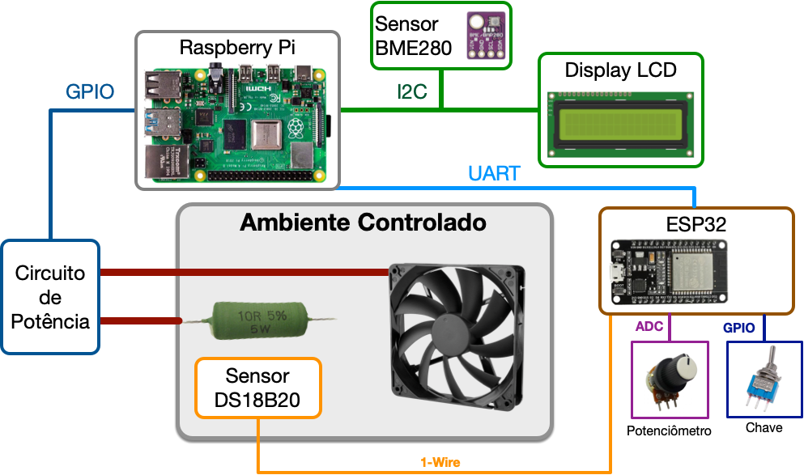
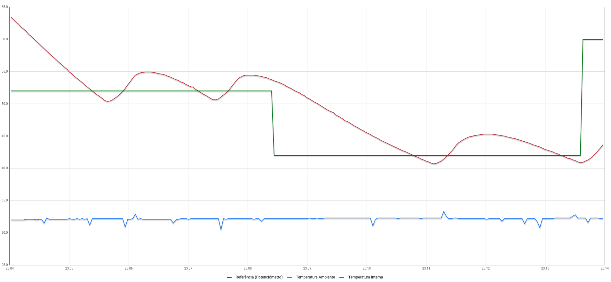
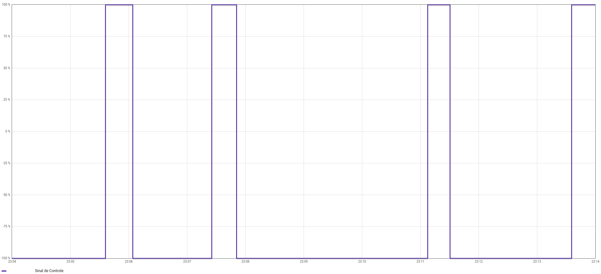
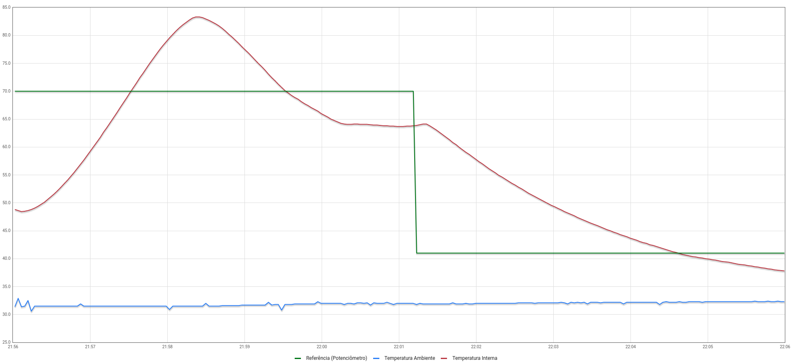
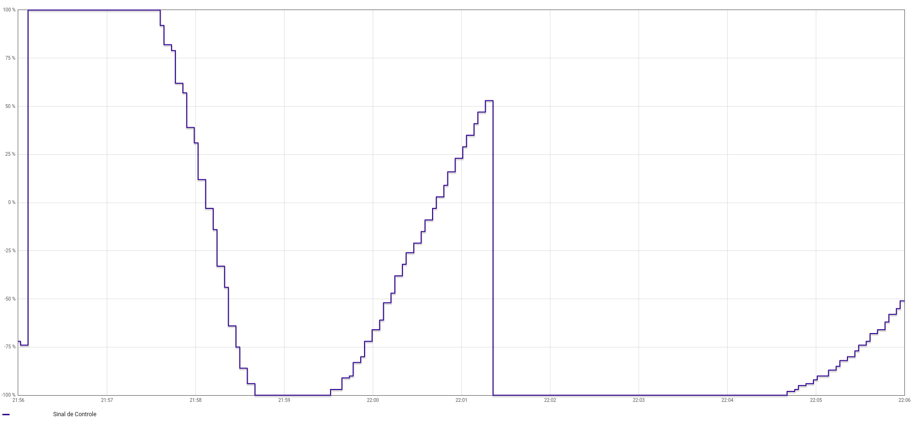
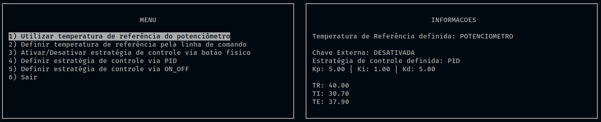

# Projeto 1 - FSE

## Introdução

Este trabalho tem por objetivo a implementação do software de uma bancada para testes de controle de temperatura de um sistema que possui internamente dois dispositivos para alterar sua temperatura. O primeiro é um resistor de potência de 15 Watts utilizado para aumentar temperatura, e o segundo é uma ventoinha que puxa o ar externo (temperatura ambiente) para reduzir a temperatura do sistema.

## Dados do aluno

| Nome | Matrícula |
| ---- | --------- |
| Fellipe dos Santos Araujo | 18/0063723 |

## Dependências
* [WiringPi GPIO](http://wiringpi.com/)
* [ncurses](https://invisible-island.net/ncurses/)

## Componentes do Sistema



## Como executar

Para executar o projeto, clone este repositório e execute os seguintes comandos:

```bash
# Entrar na pasta do projeto
$ cd system-temperature-control

# Compilar o projeto
$ make

# Executar o projeto
$ make run
```

## Relatório
Os logs dos dois experimentos realizados se encontram na pasta `/logs`.

## Experimento 1 - On/Off

Para a realização desse experimento, foi utilizado os seguintes dados:

* Temperatura de referência: potenciômetro.
  * essa temperatura variou entre 52.0, 42.0 e 60.0 graus.
* Histerese: 2.0.
* Tempo de execução: 10 minutos.

### Gráfico das Temperaturas x Tempo



*Legenda: Verde (temperatura de referência); Azul (temperatura externa); Vermelho (temperatura interna).*

### Gráfico do acionamento dos atuadores (sinal de controle)



## Experimento 2 - PID

Para a realização desse experimento, foi utilizado os seguintes dados:

* Temperatura de referência: potenciômetro.
  * essa temperatura variou entre 44.0, 70.0 e 41.0 graus.
* Kp: 5.0.
* Ki: 1.0.
* Kd: 5.0.
* Tempo de execução: 10 minutos.

### Gráfico das Temperaturas x Tempo



*Legenda: Verde (temperatura de referência); Azul (temperatura externa); Vermelho (temperatura interna).*

### Gráfico do acionamento dos atuadores (sinal de controle)



## Dashboard



## Referências

[Controle Liga/Desliga - Wikipedia](https://pt.wikipedia.org/wiki/Controle_liga-desliga)

[Controle PID - Wikipedia](https://pt.wikipedia.org/wiki/Controlador_proporcional_integral_derivativo)

[Driver da Bosh para o sensor BME280](https://github.com/BoschSensortec/BME280_driver)

[Biblioteca BCM2835 - GPIO](http://www.airspayce.com/mikem/bcm2835/)

[Controle do LCD 16x2 em C](http://www.bristolwatch.com/rpi/i2clcd.htm)

[Biblioteca WiringPi GPIO](http://wiringpi.com/)

[SoftPWM](https://www.arduino.cc/reference/en/libraries/softpwm/)
